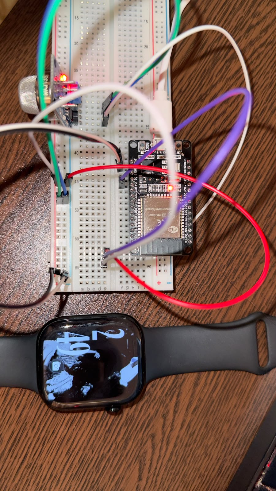
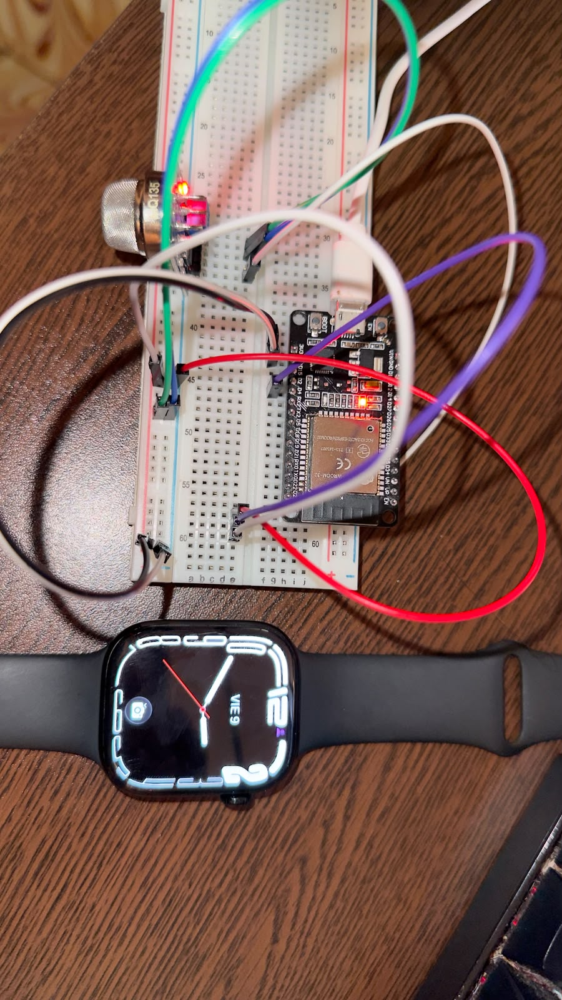

# T-1.1 — Evidencia de acondicionamiento inicial del MQ-135 (24 h)

## 1. Información general

- **Proyecto:** Sistema Telemático de Monitoreo Ambiental basado en IoT y MQTT mediante ESP32
- **Historia de usuario:** HU-01 — Lectura y publicación de variables ambientales en el ESP32
- **Tarea:** T-1.1 — Acondicionamiento inicial del MQ-135
- **Issue GitHub:** [#6](https://github.com/alfredoronald/monitoreo-IoT/issues/6)
- **Responsable:** Arnez Torrico Erick Eduardo
- **Estado:** Completado

## 2. Objetivo

Realizar el acondicionamiento inicial del sensor MQ-135 mediante alimentación continua de 5 V durante al menos 24 horas, con el propósito de estabilizar su funcionamiento antes de comenzar las lecturas de referencia de calidad del aire.

Este procedimiento constituye una actividad previa a la implementación de la tarea T-1.5, correspondiente a la lectura analógica del MQ-135 mediante el ADC del ESP32.

## 3. Descripción del procedimiento

Para realizar el acondicionamiento se utilizó un módulo MQ-135 conectado a una placa ESP32 mediante una protoboard y cables Dupont.

Las conexiones necesarias para esta etapa fueron:

| Componente | Pin | Conexión                                  |
| ---------- | --- | ----------------------------------------- |
| MQ-135     | VCC | VIN/5V del ESP32                          |
| MQ-135     | GND | GND del ESP32                             |
| MQ-135     | AO  | Sin conectar durante el acondicionamiento |
| MQ-135     | DO  | Sin conectar                              |

El ESP32 se alimentó mediante USB, proporcionando la tensión necesaria para mantener energizado el módulo MQ-135.

Durante esta etapa no se requirió adquirir datos ni publicar mensajes MQTT, debido a que el propósito fue únicamente el acondicionamiento inicial del sensor.

## 4. Registro del acondicionamiento

| Dato                              | Registro               |
| --------------------------------- | ---------------------- |
| Fecha de inicio                   | 08/10/2026             |
| Hora de inicio                    | 14:49                  |
| Fecha de cumplimiento de 24 horas | 09/10/2026             |
| Hora de cumplimiento              | 14:49                  |
| Fecha y hora real de finalización | 09/10/2026 - 14:49     |
| Duración total                    | 24 horas               |
| Interrupciones de alimentación    | Ninguna                |

**Nota:** Las 24 horas se cumplen el 09/10/2026 a las 14:49, siempre que no hayan existido interrupciones de alimentación.

## 5. Evidencias fotográficas

### 5.1 Evidencia del montaje inicial

### 5.2 Evidencia del montaje al finalizar

## 6. Criterios de aceptación

- [x] El sensor MQ-135 permaneció alimentado con 5 V durante al menos 24 horas continuas.
- [x] Se registró la fecha y hora de inicio del acondicionamiento.
- [x] Se confirmó la fecha y hora real de finalización.
- [x] Se incorporaron fotografías del montaje en la documentación.
- [x] Se verificó el cumplimiento del acondicionamiento antes de comenzar la tarea T-1.5.

## 7. Resultados

Se realizó el acondicionamiento inicial del sensor MQ-135, comenzando el 08 de octubre de 2026 a las 14:49, mediante alimentación continua de 5 V.

El 09 de octubre de 2026 a las 14:49 se cumplieron las 24 horas mínimas requeridas, sin interrupciones de alimentación durante este periodo.

Se incorporaron fotografías del montaje utilizado como evidencia del procedimiento y se verificó el cumplimiento de los criterios de aceptación establecidos en la Issue #6.

Resultado final: Acondicionamiento inicial del MQ-135 completado satisfactoriamente, quedando habilitada la continuación de la tarea T-1.5, correspondiente a la lectura analógica del sensor mediante el ESP32.

## 8. Observaciones

- El acondicionamiento inicial es una actividad previa a la adquisición de lecturas analógicas.
- El MQ-135 requiere calibración para obtener estimaciones de concentración de gases; el precalentamiento no garantiza por sí mismo valores fiables de CO₂.
- La salida analógica AO deberá conectarse al ESP32 mediante un divisor de voltaje adecuado cuando se implemente la lectura del sensor.
- La evidencia debe reflejar las condiciones reales del procedimiento.

## 9. Conclusión

Se documentó el procedimiento de acondicionamiento inicial del sensor MQ-135 y su periodo mínimo requerido de 24 horas. Una vez confirmada la alimentación continua y el cumplimiento de los criterios de aceptación, la tarea T-1.1 podrá considerarse finalizada y permitirá continuar con las actividades de adquisición y procesamiento de datos del sensor.
