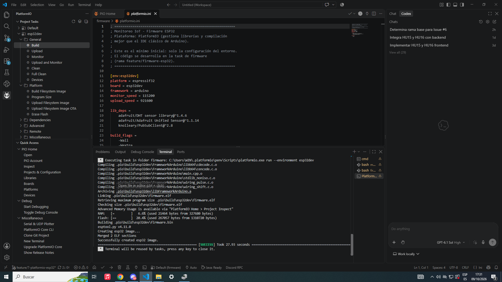
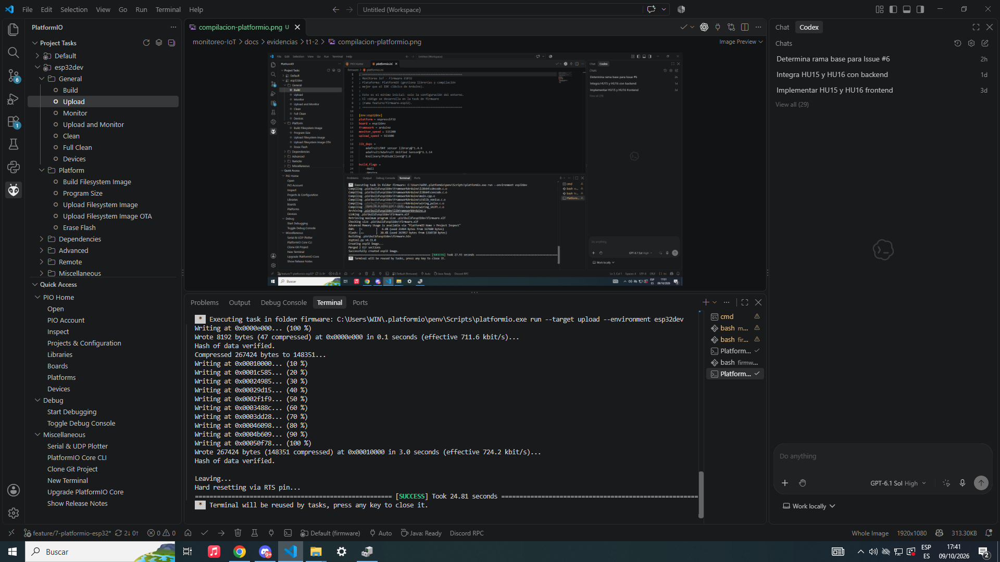
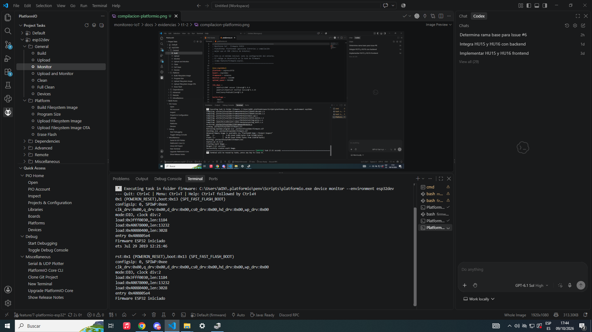

# T-1.2 — Evidencia de configuración de PlatformIO para ESP32

## 1. Información general

- **Proyecto:** Sistema Telemático de Monitoreo Ambiental basado en IoT y MQTT mediante ESP32
- **Historia de usuario:** HU-01 — Lectura y publicación de variables ambientales en el ESP32
- **Tarea:** T-1.2 — Configuración del proyecto PlatformIO para ESP32
- **Issue GitHub:** [#7](https://github.com/alfredoronald/monitoreo-IoT/issues/7)
- **Responsable:** Arnez Torrico Erick Eduardo
- **Estado:** Completado

## 2. Objetivo

Configurar y verificar el entorno de desarrollo PlatformIO para la programación del microcontrolador ESP32, utilizando el framework Arduino y las dependencias necesarias para la posterior integración de sensores ambientales y comunicación MQTT.

## 3. Configuración del entorno

Se utilizó Visual Studio Code con la extensión PlatformIO IDE para administrar el proyecto de firmware.

| Parámetro | Configuración |
|---|---|
| Microcontrolador | ESP32-WROOM-32 |
| Entorno PlatformIO | esp32dev |
| Framework | Arduino |
| Monitor serie | 115200 baudios |
| Puerto de comunicación | COM3 |
| Librería DHT | Adafruit DHT Sensor Library 1.4.6 |
| Librería auxiliar | Adafruit Unified Sensor 1.1.14 |
| Librería MQTT | PubSubClient 2.8 |

Se implementó el archivo `firmware/include/config.example.h` como plantilla de configuración con valores ficticios para Wi-Fi y MQTT.

También se verificó que `firmware/include/config.h` esté excluido del control de versiones para evitar la publicación de credenciales privadas.

## 4. Procedimiento realizado

1. Se verificó la configuración del archivo `firmware/platformio.ini`.
2. Se preparó la plantilla de credenciales para futuras conexiones Wi-Fi y MQTT.
3. Se implementó la inicialización del puerto serie a 115200 baudios.
4. Se añadió el mensaje de arranque `Firmware ESP32 iniciado`.
5. Se ejecutó la compilación desde PlatformIO utilizando el entorno `esp32dev`.
6. Se conectó el ESP32 a la computadora mediante USB y se identificó el puerto COM3.
7. Se cargó el firmware al microcontrolador.
8. Se abrió el monitor serie y se verificó el mensaje de arranque.

## 5. Evidencias

### 5.1 Compilación de PlatformIO

La compilación finalizó exitosamente, generando el archivo de firmware para ESP32.

**Resultado:** PASS — SUCCESS.

### 5.2 Carga del firmware al ESP32

La transferencia del firmware mediante USB se completó exitosamente y PlatformIO verificó los datos escritos.

**Resultado:** PASS — SUCCESS.

### 5.3 Verificación del monitor serie

Al iniciar y reiniciar el microcontrolador, se obtuvo el mensaje esperado:

`Firmware ESP32 iniciado`

**Resultado:** PASS.

## 6. Criterios de aceptación

- [x] **CA-01:** El proyecto PlatformIO compila sin errores mediante el entorno `esp32dev`.
- [x] **CA-02:** Existe una plantilla `config.example.h` versionable y el archivo privado `config.h` está excluido mediante `.gitignore`.
- [x] **CA-03:** El monitor serie muestra el mensaje de inicio del firmware a 115200 baudios.

**Resultado general:** 3 de 3 criterios de aceptación cumplidos.

## 7. Resultados

La configuración inicial de PlatformIO para el ESP32 fue completada y verificada mediante pruebas de compilación, carga y ejecución física.

Se generó exitosamente el firmware, se transfirió al microcontrolador mediante el puerto COM3 y se confirmó la ejecución del programa al observar el mensaje `Firmware ESP32 iniciado` en el monitor serie.

La plantilla de credenciales y las librerías configuradas permiten preparar las siguientes tareas de lectura de sensores y comunicación MQTT sin incorporar todavía dichas funcionalidades.

## 8. Observaciones

- Las pruebas se realizaron con el ESP32 conectado mediante USB, sin sensores externos.
- La comunicación Wi-Fi y MQTT no forma parte de esta tarea.
- La configuración GPIO y la lectura de sensores serán implementadas en tareas posteriores.
- No se realizaron pruebas funcionales de los sensores DHT22 y MQ-135.

## 9. Conclusión

Se completó la configuración del entorno de desarrollo PlatformIO y se comprobó el funcionamiento inicial del ESP32 mediante compilación, carga del firmware y comunicación serie. La tarea T-1.2 queda finalizada y proporciona una base funcional para continuar con las siguientes actividades de la HU-01.