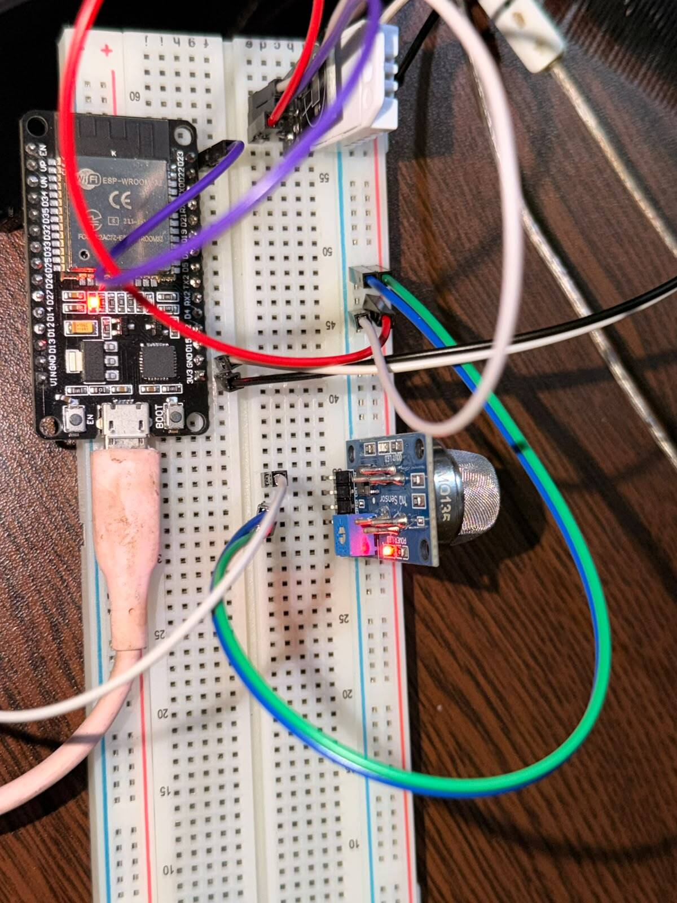
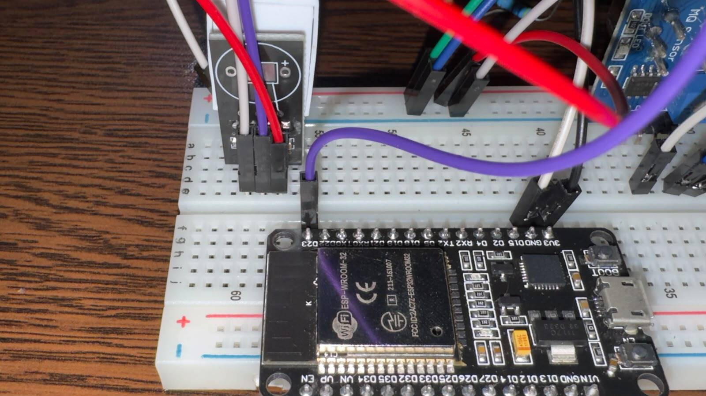
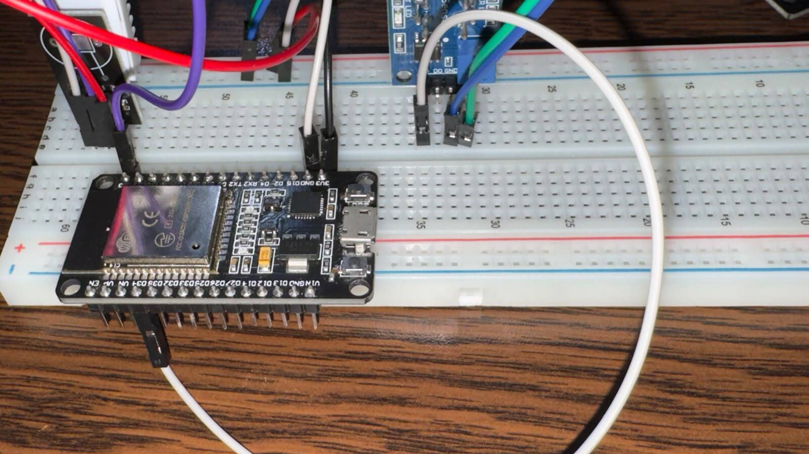

# T-1.3 — Evidencia del montaje ESP32, DHT22 y MQ-135

## 1. Información general

- **Proyecto:** Sistema Telemático de Monitoreo Ambiental basado en IoT y MQTT mediante ESP32.
- **Historia de usuario:** HU-01 — Lectura y publicación de variables ambientales en el ESP32.
- **Tarea:** T-1.3 — Montaje del circuito en protoboard.
- **Issue GitHub:** [#9](https://github.com/alfredoronald/monitoreo-IoT/issues/9).
- **Responsable:** Arnez Torrico Erick Eduardo.
- **Rama:** `docs/9-circuito-esp32`.
- **Estado:** Montaje realizado; documentación de evidencias incorporada.

## 2. Objetivo

Realizar y documentar el montaje del circuito de monitoreo ambiental mediante la integración de un ESP32 con los sensores DHT22 y MQ-135 en una protoboard, estableciendo las conexiones de alimentación y señal necesarias para las posteriores tareas de adquisición de datos.

## 3. Componentes utilizados

| Componente | Función |
|---|---|
| ESP32-WROOM-32 | Microcontrolador principal |
| DHT22 | Medición de temperatura y humedad |
| MQ-135 | Sensor de calidad del aire |
| Protoboard | Montaje del circuito |
| Cables Dupont | Conexión de los componentes |
| Cable USB | Alimentación y programación del ESP32 |

## 4. Montaje y conexiones

El ESP32 fue instalado en una protoboard junto con los sensores DHT22 y MQ-135. Se establecieron las siguientes conexiones:

| Componente | Terminal | Conexión |
|---|---|---|
| DHT22 | VCC (+) | 3V3 del ESP32 |
| DHT22 | DATA (OUT) | GPIO23 |
| DHT22 | GND (-) | GND |
| MQ-135 | VCC | VIN/5V del ESP32 |
| MQ-135 | GND | GND común |
| MQ-135 | AO | GPIO34 (ADC1_CH6), con adaptación de tensión declarada |
| MQ-135 | DO | Sin conectar |

Se seleccionó GPIO34 porque pertenece al ADC1 del ESP32, lo que permite utilizar la entrada analógica junto con las funcionalidades Wi-Fi previstas para el sistema.

Para la señal AO del MQ-135 se requiere protección eléctrica que mantenga la tensión dentro del límite admitido por el ESP32. La instalación de un divisor fue indicada durante el montaje, aunque sus valores y la medición numérica no quedaron registrados en esta evidencia.

El detalle de las conexiones se encuentra en `firmware/docs/pinout.md`.

## 5. Evidencias fotográficas

### 5.1 Montaje general

**Figura 1.** Montaje general del ESP32 junto con los sensores DHT22 y MQ-135 sobre la protoboard.

### 5.2 Conexión del DHT22

**Figura 2.** Conexión del sensor DHT22 mediante sus terminales de alimentación, datos y tierra.

### 5.3 Conexión del MQ-135

**Figura 3.** Conexiones del módulo MQ-135 utilizado para la adquisición de señales relacionadas con la calidad del aire.

## 6. Criterios de aceptación

| Código | Criterio de aceptación | Estado |
|---|---|---|
| CA-01 | Utilizar una entrada ADC1 para el MQ-135. | Cumplido |
| CA-02 | Verificar que la tensión de entrada no supere 3,3 V. | Reportado como cumplido; falta registro numérico |
| CA-03 | Documentar las conexiones y la selección de ADC1 en `firmware/docs/pinout.md`. | Cumplido |
| CA-04 | Registrar fotografías reales del circuito montado. | Cumplido |

Los criterios se registran conforme a la información reportada para la tarea. La lectura del multímetro y los valores del divisor deberán añadirse para completar la trazabilidad eléctrica del CA-02.

## 7. Resultados

Se realizó el montaje de los componentes principales del sistema de monitoreo ambiental sobre una protoboard.

Se establecieron las conexiones del DHT22 con GPIO23 y del MQ-135 con GPIO34, correspondiente al canal ADC1_CH6. Asimismo, se documentó la distribución de alimentación y se incorporaron tres fotografías del circuito como evidencia.

El montaje proporciona la base física para continuar con la lectura de temperatura, humedad y señal analógica del sensor de calidad del aire.

## 8. Relación con las siguientes tareas

| Tarea | Actividad |
|---|---|
| T-1.4 — Issue #10 | Implementar la lectura del DHT22 |
| T-1.5 — Issue #11 | Implementar la lectura analógica del MQ-135 |
| T-1.6 — Issue #12 | Configurar la conexión Wi-Fi y MQTT |
| T-1.7 — Issue #13 | Publicar periódicamente las variables ambientales |

Estas tareas utilizarán el montaje y el pinout establecidos en la T-1.3.

## 9. Conclusión

Se realizó el montaje del circuito de monitoreo ambiental, integrando el ESP32 con los sensores DHT22 y MQ-135 mediante una protoboard. Se definieron las conexiones de alimentación y comunicación, se documentó el pinout y se incorporaron fotografías reales del montaje.

La tarea establece la base física necesaria para continuar con la programación y las pruebas de lectura de los sensores. Queda por incorporar el valor medido en GPIO34 para respaldar documentalmente la verificación del límite de tensión.