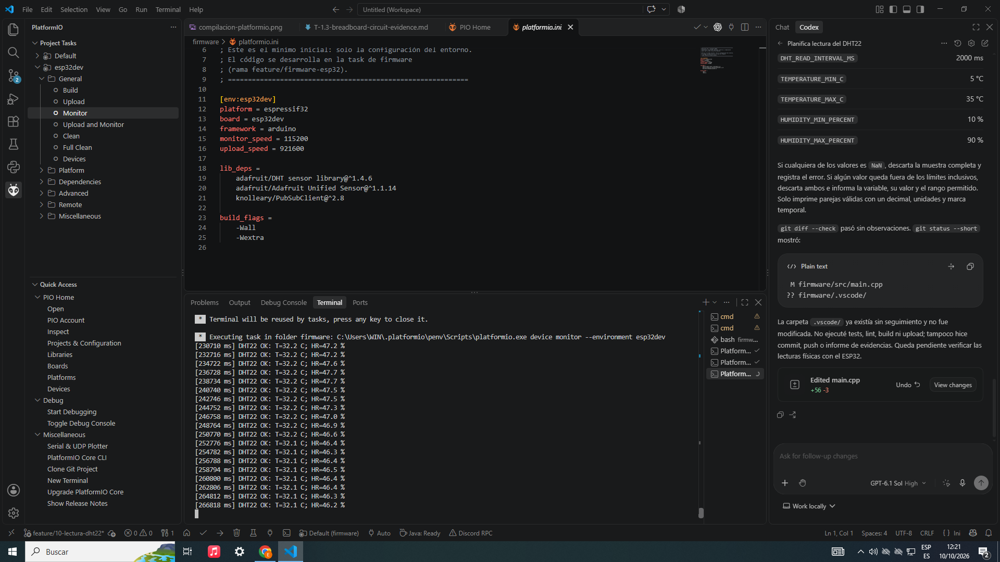
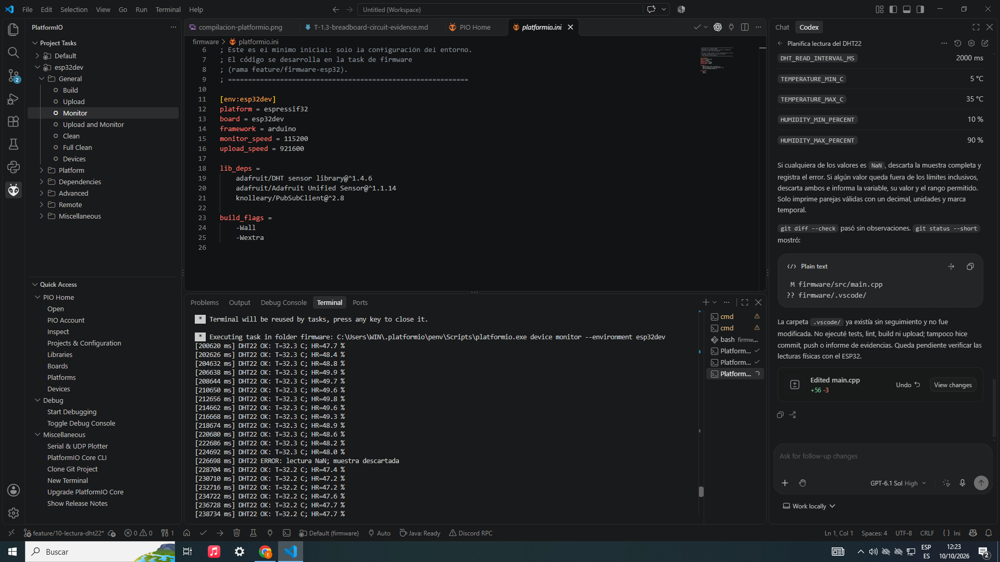
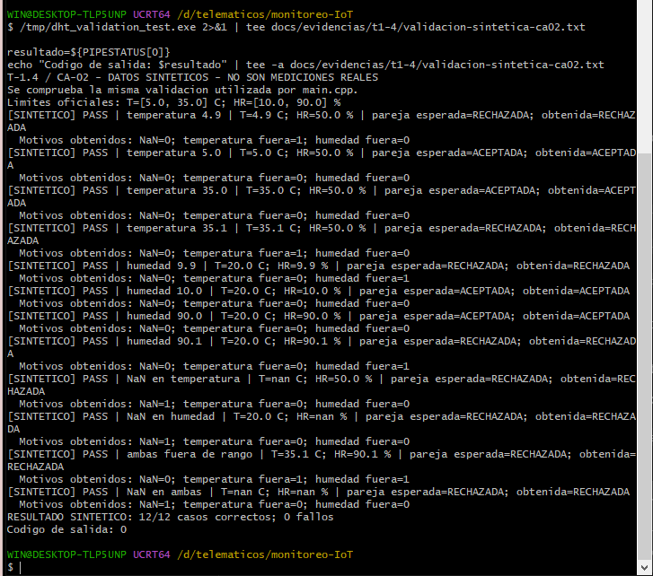

# T-1.4 — Implementación y evidencia de lectura del sensor DHT22

## 1. Información general

- **Proyecto:** Sistema Telemático de Monitoreo Ambiental basado en IoT y MQTT mediante ESP32.
- **Historia de usuario:** HU-01 — Lectura y publicación de variables ambientales en el ESP32.
- **Tarea:** T-1.4 — Lectura del DHT22 con filtro de rango.
- **Issue GitHub:** [#10](https://github.com/alfredoronald/monitoreo-IoT/issues/10).
- **Responsable:** Arnez Torrico Erick Eduardo.
- **Rama de trabajo:** `feature/10-lectura-dht22`.
- **Rama base:** `feature/firmware-esp32`.
- **Estado:** Implementación completada y criterios de aceptación verificados.

## 2. Objetivo

Implementar y verificar la lectura periódica de temperatura y humedad relativa mediante el sensor DHT22 conectado al ESP32, incorporando mecanismos de validación para descartar datos inválidos o fuera de los rangos ambientales establecidos.

Asimismo, comprobar el funcionamiento de la adquisición mediante el monitor serie y validar los límites definidos utilizando pruebas controladas.

## 3. Implementación

### 3.1 Configuración del sensor

El sensor DHT22 se encuentra conectado al **GPIO23 del ESP32** y se utiliza la biblioteca `DHT.h` para obtener los valores de temperatura en grados Celsius y humedad relativa en porcentaje.

La adquisición se ejecuta mediante un temporizador basado en `millis()`, estableciendo un intervalo mínimo de 2000 milisegundos entre intentos de lectura. Este mecanismo permite realizar las adquisiciones sin bloquear la ejecución del programa mediante esperas prolongadas.

| Parámetro | Configuración |
|---|---|
| Microcontrolador | ESP32-WROOM-32 |
| Sensor | DHT22 |
| Pin de datos | GPIO23 |
| Intervalo mínimo | 2000 ms |
| Comunicación de diagnóstico | Serial a 115200 baudios |
| Entorno de desarrollo | PlatformIO con framework Arduino |

### 3.2 Validación de temperatura y humedad

Se implementó un filtro para verificar que las mediciones se encuentren dentro de los límites ambientales establecidos para el aula.

| Variable | Valor mínimo | Valor máximo |
|---|---:|---:|
| Temperatura | 5 °C | 35 °C |
| Humedad relativa | 10 % HR | 90 % HR |

Los límites son inclusivos y se encuentran definidos mediante constantes en `firmware/include/dht_validation.h`, facilitando su mantenimiento y modificación posterior.

El sistema aplica las siguientes reglas:

- Descarta la muestra completa cuando la temperatura o la humedad presenta un valor `NaN`.
- Descarta la muestra cuando cualquiera de las variables se encuentra fuera del rango permitido.
- Registra en el monitor serie el motivo de las lecturas rechazadas.
- Muestra únicamente las parejas válidas de temperatura y humedad, utilizando un decimal y sus respectivas unidades.
- Continúa realizando nuevos intentos de lectura después de detectar un error.

La adquisición del sensor se encuentra implementada en `firmware/src/main.cpp`, mientras que la lógica de validación está centralizada en `firmware/include/dht_validation.h`.

## 4. Pruebas realizadas y evidencias

### 4.1 Verificación de lecturas reales

Se realizó una prueba física utilizando el ESP32 y el sensor DHT22, observando los resultados mediante el monitor serie de PlatformIO.

Durante aproximadamente **4 minutos y 51 segundos**, el sistema registró lecturas periódicas de temperatura y humedad. Los valores obtenidos se mantuvieron dentro de los límites establecidos.

| Parámetro evaluado | Resultado observado |
|---|---|
| Temperatura mínima | 32,0 °C |
| Temperatura máxima | 32,9 °C |
| Humedad relativa mínima | 45,6 % |
| Humedad relativa máxima | 54,1 % |
| Intervalo habitual entre lecturas | 2006 ms |
| Presentación de resultados | Un decimal |
| Comunicación serial | 115200 baudios |

**Evidencia 1. Lecturas válidas del sensor DHT22**

La captura muestra la adquisición continua de temperatura y humedad, incluyendo los tiempos de ejecución y la presentación de los valores con un decimal.

### 4.2 Detección de errores y recuperación

Durante las pruebas se presentó una lectura inválida (`NaN`) en el instante **226698 ms**.

El firmware detectó el error, descartó la muestra y registró el mensaje correspondiente en el monitor serie.

En el siguiente intento, a los **228704 ms**, el sensor volvió a proporcionar valores válidos sin necesidad de reiniciar el ESP32.

**Evidencia 2. Detección de NaN y recuperación**

Este resultado demuestra que el firmware puede identificar una lectura inválida y continuar automáticamente con el proceso de adquisición.

### 4.3 Validación de límites mediante pruebas sintéticas

Para comprobar el funcionamiento del filtro sin exponer físicamente el sensor a condiciones ambientales extremas, se desarrolló una prueba independiente con **12 casos de datos sintéticos**.

La prueba utiliza la misma lógica de validación que el firmware y comprueba valores dentro del rango, límites exactos, valores fuera del rango y lecturas `NaN`.

| Caso de prueba | Valor evaluado | Resultado esperado | Resultado |
|---|---|---|---|
| TC-01 | Temperatura 4,9 °C | Rechazado | PASS |
| TC-02 | Temperatura 5,0 °C | Aceptado | PASS |
| TC-03 | Temperatura 35,0 °C | Aceptado | PASS |
| TC-04 | Temperatura 35,1 °C | Rechazado | PASS |
| TC-05 | Humedad 9,9 % | Rechazado | PASS |
| TC-06 | Humedad 10,0 % | Aceptado | PASS |
| TC-07 | Humedad 90,0 % | Aceptado | PASS |
| TC-08 | Humedad 90,1 % | Rechazado | PASS |
| TC-09 | Temperatura `NaN` | Rechazado | PASS |
| TC-10 | Humedad `NaN` | Rechazado | PASS |
| TC-11 | Temperatura y humedad fuera de rango | Rechazado | PASS |
| TC-12 | Temperatura y humedad `NaN` | Rechazado | PASS |

**Resultado de la ejecución:**

- **Casos ejecutados:** 12.
- **Casos aprobados:** 12.
- **Casos fallidos:** 0.
- **Código de salida:** 0.
- **Compilador utilizado:** GCC 16.2.0 mediante MSYS2 UCRT64.

**Evidencia 3. Resultado de la validación sintética**

El registro completo de ejecución se encuentra disponible en [validacion-sintetica-ca02.txt](./evidencias/t1-4/validacion-sintetica-ca02.txt).

Estas pruebas verifican exclusivamente la lógica del filtro. Las mediciones físicas del DHT22 se documentan de manera independiente en las secciones anteriores.

## 5. Verificación de criterios de aceptación

| Código | Criterio de aceptación | Evidencia de cumplimiento | Estado |
|---|---|---|---|
| CA-01 | Realizar lecturas con un intervalo mínimo de 2 segundos. | Temporizador de 2000 ms y registros reales con intervalos habituales de 2006 ms. | Cumplido |
| CA-02 | Descartar lecturas `NaN` y valores fuera de 5–35 °C o 10–90 % HR, registrando el motivo. | Rechazo real de `NaN` y ejecución exitosa de 12 casos sintéticos de validación. | Cumplido |
| CA-03 | Presentar los valores válidos con un decimal. | Capturas del monitor serie con temperatura y humedad expresadas con un decimal. | Cumplido |
| CA-04 | Definir los límites ambientales mediante constantes. | Constantes implementadas en `firmware/include/dht_validation.h`. | Cumplido |

**Resultado general: 4 de 4 criterios de aceptación cumplidos.**

## 6. Resultados obtenidos

La implementación permitió adquirir datos reales de temperatura y humedad relativa mediante el DHT22 conectado al ESP32, manteniendo un intervalo de lectura superior a dos segundos.

Las mediciones observadas se encontraron dentro de los rangos ambientales definidos. Asimismo, el sistema identificó una lectura inválida, descartó la muestra y recuperó la adquisición automáticamente en el siguiente intento.

La validación mediante datos sintéticos permitió comprobar los límites inferiores y superiores de temperatura y humedad, además del rechazo de valores fuera de rango y `NaN`, obteniendo **12 casos aprobados de 12 ejecutados**.

Con estos resultados se verificó tanto el funcionamiento físico de la adquisición como el comportamiento de la lógica de validación implementada.

## 7. Conclusión

Se implementó y verificó la lectura periódica de temperatura y humedad relativa del sensor DHT22 mediante el ESP32, utilizando GPIO23 y un intervalo mínimo de dos segundos.

Las pruebas físicas confirmaron la obtención continua de valores válidos y la capacidad del sistema para detectar lecturas erróneas y continuar operando sin reiniciarse. Por su parte, las pruebas sintéticas permitieron comprobar el rechazo de valores fuera de los límites establecidos, alcanzando 12 casos aprobados sin fallos.

De esta manera, **la tarea T-1.4 cumple sus cuatro criterios de aceptación** y proporciona una base funcional para integrar las mediciones ambientales con las siguientes etapas de procesamiento y publicación de datos mediante MQTT.