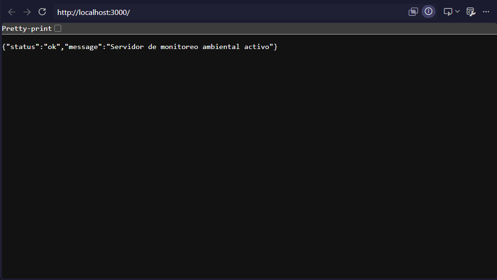
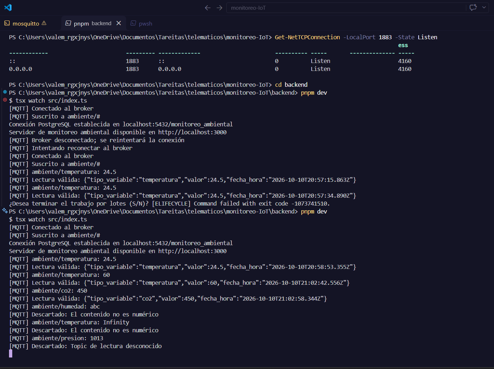

# Validación de mensajes MQTT — #20

## Implementación

- Dependencia: #19, integrada mediante la PR #54.
- Rama de tarea: `feat/20-message-validation`.
- Rama base y destino de la PR: `feature/backend-mqtt-api`.
- PR de la tarea: [#57](https://github.com/alfredoronald/monitoreo-IoT/pull/57).
- Módulo independiente: `backend/src/mqtt/messageValidator.ts`.
- Integración: evento `message` de `backend/src/mqtt/mqttSubscriber.ts`.

Solo se aceptan los topics completos `ambiente/temperatura`,
`ambiente/humedad` y `ambiente/co2`. El contenido debe ser un número
decimal finito; puede incluir signo, notación científica y espacios
alrededor. Se rechazan contenidos vacíos, texto adicional, `NaN`,
`Infinity`, valores no finitos y formatos como `0x10` o `24,5`.

Una lectura válida contiene únicamente `tipo_variable`, `valor` y
`fecha_hora`. El instante se genera al validar el mensaje, en ISO 8601 UTC.
Los descartes no contienen un objeto de lectura y el suscriptor termina
su procesamiento antes de generar el JSON. Esto incluye `ambiente/status`
aunque su contenido sea numérico. La persistencia se implementa en #28.

## Cómo reproducir la evidencia

Desde `backend/`:

```powershell
pnpm install --frozen-lockfile
pnpm test
pnpm typecheck
pnpm build
pnpm evidence:validation
```

El último comando ejecuta directamente el módulo, sin requerir servicios
externos. Muestra un JSON de temperatura y los descartes por contenido no
numérico, mensaje de estado y topic desconocido. La fecha cambia en cada
ejecución.

## Resultados de verificación

- `pnpm test`: seis pruebas aprobadas, cero fallos.
- `pnpm typecheck`: aprobado.
- `pnpm build`: aprobado.
- `pnpm evidence:validation`: JSON válido y tres descartes confirmados.
- La prueba del suscriptor usa un servidor TCP MQTT mínimo en un puerto
  efímero: envía cuatro mensajes y comprueba que se genera un único JSON.
  No usa credenciales reales ni depende de Mosquitto.

## Verificación con servicios locales

La verificación local se completó el 10 de octubre de 2026. PostgreSQL
aceptó la conexión como `app` a `monitoreo_ambiental` y Mosquitto estaba
escuchando en el puerto 1883. El backend arrancó con `pnpm dev`, se suscribió
a `ambiente/#` y respondió HTTP 200 en `http://localhost:3000/`:

```json
{"status":"ok","message":"Servidor de monitoreo ambiental activo"}
```



### JSON válido y descartes

La publicación con el usuario `esp32` de `24.5` en `ambiente/temperatura`
generó el siguiente JSON en la consola del backend:

```json
{"tipo_variable":"temperatura","valor":24.5,"fecha_hora":"2026-10-10T20:58:53.355Z"}
```

También se confirmó un JSON de `co2` con valor `450`. Los mensajes `abc`
en `ambiente/humedad` e `Infinity` en `ambiente/temperatura` se descartaron
por contenido no numérico; `1013` en `ambiente/presion` se descartó por
topic desconocido.



Las capturas muestran el navegador y la terminal del backend sin contraseñas.
En la captura de consola se observa una interrupción manual del proceso,
seguida de un arranque correcto y las pruebas de validación.

### Mensaje de estado

En una prueba posterior, confirmada por la responsable de la tarea, se
publicó `1` en `ambiente/status` y se obtuvo:

```text
[MQTT] ambiente/status: 1
[MQTT] Descartado: El mensaje de estado no es una lectura
```

Este caso no aparece en la captura anterior; está cubierto también por las
pruebas automatizadas del módulo y del suscriptor. No genera un objeto de
lectura ni continúa hacia el procesamiento de lecturas.

### Cómo repetir la prueba manual

1. Completar las variables `PG_*` y `MQTT_*` siguiendo `.env.example`.
2. Levantar PostgreSQL y Mosquitto según el README.
3. Ejecutar `pnpm dev` desde `backend/` y comprobar la respuesta HTTP 200.
4. Publicar con el usuario `esp32` los siguientes mensajes, usando sus
   credenciales locales:

   | Topic | Contenido | Resultado confirmado |
   |---|---|---|
   | `ambiente/temperatura` | `24.5` | JSON de lectura válida |
   | `ambiente/humedad` | `abc` | Descartado por contenido no numérico |
   | `ambiente/status` | `1` | Descartado por no ser una lectura |
   | `ambiente/presion` | `1013` | Descartado por topic desconocido |

5. Comprobar que solo el mensaje válido produce una línea de `Lectura válida`.
