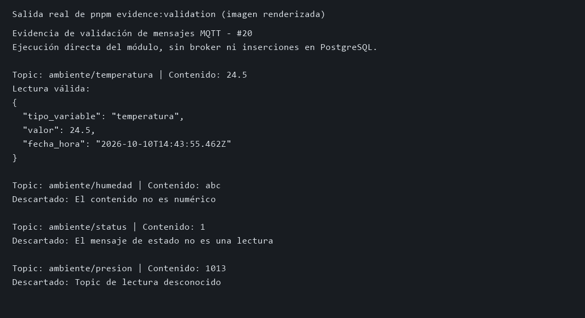

# Validación de mensajes MQTT — #20

## Implementación

- Dependencia: #19, integrada mediante la PR #54.
- Rama de tarea: `feat/20-message-validation`.
- Rama base y destino de la PR: `feature/backend-mqtt-api`.
- Módulo independiente: `backend/src/mqtt/messageValidator.ts`.
- Integración: evento `message` de `backend/src/mqtt/mqttSubscriber.ts`.

Solo se aceptan los topics completos `ambiente/temperatura`,
`ambiente/humedad` y `ambiente/co2`. El contenido debe ser un número
decimal finito; puede incluir signo, notación científica y espacios
alrededor. Se rechazan contenidos vacíos, texto adicional, `NaN`,
`Infinity`, valores no finitos y formatos como `0x10` o `24,5`.

Una lectura válida contiene únicamente `tipo_variable`, `valor` y
`fecha_hora`. El instante se genera al validar el mensaje, en ISO 8601 UTC.
Los descartes no contienen un objeto de lectura y el suscriptor termina
su procesamiento antes de generar el JSON. Esto incluye `ambiente/status`
aunque su contenido sea numérico. La persistencia se implementa en #28.

## Cómo reproducir la evidencia

Desde `backend/`:

```powershell
pnpm install --frozen-lockfile
pnpm test
pnpm typecheck
pnpm build
pnpm evidence:validation
```

El último comando ejecuta directamente el módulo, sin requerir servicios
externos. Muestra un JSON de temperatura y los descartes por contenido no
numérico, mensaje de estado y topic desconocido. La fecha cambia en cada
ejecución.



La imagen es una representación renderizada de la salida real del comando;
no es una captura del escritorio ni una prueba con el broker de producción.

## Resultados de verificación

- `pnpm test`: seis pruebas aprobadas, cero fallos.
- `pnpm typecheck`: aprobado.
- `pnpm build`: aprobado.
- `pnpm evidence:validation`: JSON válido y tres descartes confirmados.
- La prueba del suscriptor usa un servidor TCP MQTT mínimo en un puerto
  efímero: envía cuatro mensajes y comprueba que se genera un único JSON.
  No usa credenciales reales ni depende de Mosquitto.

## Verificación con servicios locales

El intento de arranque local se detuvo porque faltan variables de conexión
PostgreSQL en `backend/.env`. El broker local tampoco estaba escuchando
en el puerto 1883. Queda pendiente esta comprobación con el entorno completo:

1. Completar las variables `PG_*` y `MQTT_*` siguiendo `.env.example`.
2. Levantar PostgreSQL y Mosquitto según el README.
3. Ejecutar `pnpm dev` desde `backend/` y comprobar la respuesta HTTP 200.
4. Publicar con el usuario `esp32` los siguientes mensajes, usando sus
   credenciales locales:

   | Topic | Contenido | Resultado esperado |
   |---|---|---|
   | `ambiente/temperatura` | `24.5` | JSON de lectura válida |
   | `ambiente/humedad` | `abc` | Descartado por contenido no numérico |
   | `ambiente/status` | `1` | Descartado por no ser una lectura |
   | `ambiente/presion` | `1013` | Descartado por topic desconocido |

5. Capturar la consola sin mostrar credenciales y adjuntar la captura a la PR.
